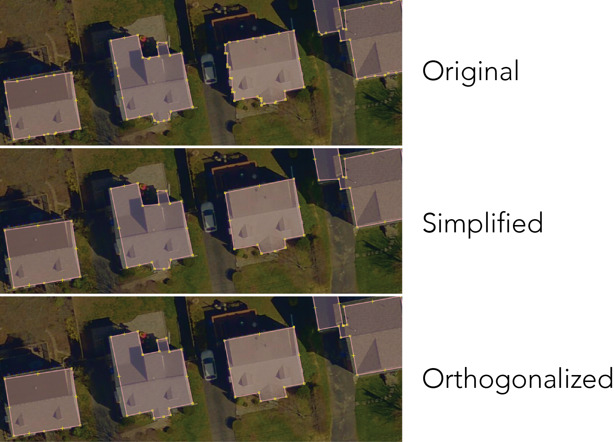

# Orthogonalize polygon in python
 Orthogonalize polygon in python by making all its angles 90 or 180 deg
 Python implementation of JOSM orthogonalize function for squaring of buildings.
 
 Example:
 
